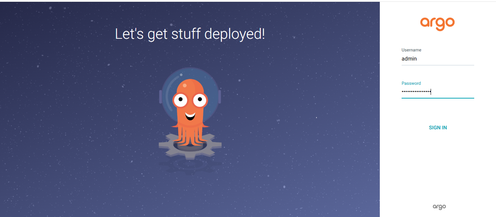
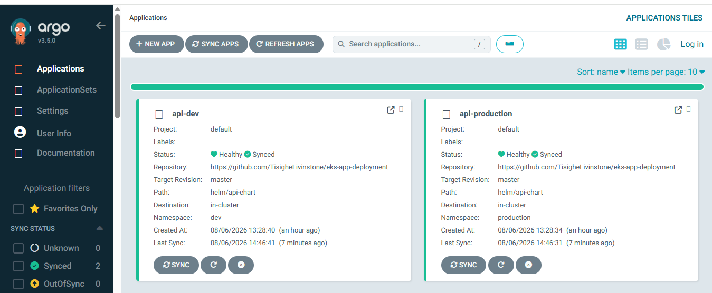
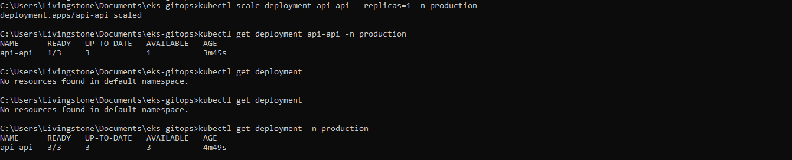

# EKS GitOps

GitOps configuration for the EKS cluster from [eks-terraform-foundation](https://github.com/TisigheLivinstone/eks-terraform-foundation). Argo CD watches this repo and syncs the cluster to match — every change goes through Git, every deployment is traceable.

Part of the Production EKS on AWS series:
- [Part 1 — Networking](https://www.livinstone.dev/blog/terraform-multi-environment-iac)
- [Part 2 — EKS Cluster](https://www.livinstone.dev/blog/building-production-eks-cluster-from-scratch)
- [Part 3 — Application Deployment](https://www.livinstone.dev/blog/eks-deploying-scaling-applications)
- [Part 4 — GitHub Actions CI/CD](https://www.livinstone.dev/blog/github-actions-cicd-pipeline-to-kubernetes)
- **Part 5 — GitOps with Argo CD (this repo)**

## Before You Start

Update these values before deploying:

| File | Placeholder | Replace with |
|------|------------|-------------|
| `apps/api-production.yaml` | `YOUR_ACCOUNT_ID` | Your AWS account ID |
| `apps/api-dev.yaml` | `YOUR_ACCOUNT_ID` | Your AWS account ID |
| `environments/production/values.yaml` | `YOUR_ACCOUNT_ID` | Your AWS account ID |
| `environments/dev/values.yaml` | `YOUR_ACCOUNT_ID` | Your AWS account ID |

Your ECR repository URI will look like:
```
123456789012.dkr.ecr.eu-west-1.amazonaws.com/api
```

## Structure

```
eks-gitops/
├── apps/
│   ├── api-production.yaml   # Argo CD Application — production
│   └── api-dev.yaml          # Argo CD Application — dev
├── environments/
│   ├── production/
│   │   └── values.yaml       # Production Helm values
│   └── dev/
│       └── values.yaml       # Dev Helm values
└── install/
    ├── install-argocd.sh         # Install Argo CD
    └── install-image-updater.sh  # Install Image Updater
```

## Prerequisites

- EKS cluster running with `kubectl` configured (`kubectl get nodes` works)
- Helm 3 installed
- AWS CLI configured
- `eks-app-deployment` repo already deployed on the cluster

## Setup

**Step 1 — Create the Argo CD namespace and install:**

```bash
kubectl create namespace argocd
kubectl apply -n argocd -f https://raw.githubusercontent.com/argoproj/argo-cd/stable/manifests/install.yaml

# Wait for all pods to be Running (~2 minutes)
kubectl get pods -n argocd -w
```

Expected output:
```
argocd-application-controller-0         1/1   Running
argocd-applicationset-controller-xxx    1/1   Running
argocd-dex-server-xxx                   1/1   Running
argocd-notifications-controller-xxx     1/1   Running
argocd-redis-xxx                        1/1   Running
argocd-repo-server-xxx                  1/1   Running
argocd-server-xxx                       1/1   Running
```

**Step 2 — Get the admin password:**

```bash
kubectl -n argocd get secret argocd-initial-admin-secret \
  -o jsonpath="{.data.password}" | base64 -d && echo
```

On Windows (PowerShell):
```powershell
[System.Text.Encoding]::UTF8.GetString(
  [System.Convert]::FromBase64String(
    (kubectl -n argocd get secret argocd-initial-admin-secret -o jsonpath="{.data.password}")
  )
)
```

**Step 3 — Access the UI:**

```bash
kubectl port-forward svc/argocd-server -n argocd 8080:443
# Open https://localhost:8080
# Username: admin | Password: from Step 2
```

**Step 4 — Deploy the Applications:**

```bash
kubectl apply -f apps/api-production.yaml
kubectl apply -f apps/api-dev.yaml
```

> **Note:** The `eks-app-deployment` repo uses the `master` branch. Both manifests are set to `targetRevision: master`. If you see `unable to resolve 'main' to a commit SHA`, check that `targetRevision` matches your repo's default branch.

**Step 5 — Verify sync:**

```bash
kubectl get applications -n argocd
# NAME             SYNC STATUS   HEALTH STATUS
# api-dev          Synced        Healthy
# api-production   Synced        Healthy

kubectl get pods -n production
# NAME                     READY   STATUS    RESTARTS
# api-api-xxxxxxx-xxxxx    1/1     Running   0  (x3)

kubectl get pods -n dev
# NAME                     READY   STATUS    RESTARTS
# api-api-xxxxxxx-xxxxx    1/1     Running   0
```

**Step 6 — Install Image Updater (automatic image tag updates):**

```bash
kubectl apply -n argocd \
  -f https://raw.githubusercontent.com/argoproj-labs/argocd-image-updater/stable/manifests/install.yaml

kubectl get pods -n argocd | grep image-updater
# argocd-image-updater-xxx   1/1   Running
```
## How It Works

1. Developer pushes code to `eks-app-deployment`
2. CodeBuild builds the image and pushes to ECR with the commit SHA as the tag
3. Image Updater detects the new image in ECR and commits the updated tag to this repo
4. Argo CD detects the Git change and syncs the cluster automatically
5. New pods roll out — the readiness probe gates traffic until they pass



## Test Self-Healing

```bash
# Scale down manually — bypassing Git entirely
kubectl scale deployment api-api --replicas=1 -n production

# Check immediately — shows 1 replica
kubectl get deployment api-api -n production
# NAME      READY   REPLICAS
# api-api   1/3     1  ← changed manually

# Wait 3 minutes without doing anything
kubectl get deployment api-api -n production
# NAME      READY   REPLICAS
# api-api   3/3     3  ← Argo CD reverted it automatically
```


## Rollback

```bash
# Preferred — creates a commit in Git history with author, timestamp, and reason
git revert HEAD
git push
# Argo CD detects the revert and syncs the cluster back automatically

# Emergency only — bypasses Git, leaves no trace in history
argocd app rollback api-production 1
```

## Full write-up

[GitOps with Argo CD: A Practical Kubernetes Guide](https://www.livinstone.dev/blog/setting-up-argocd-gitops-kubernetes)
